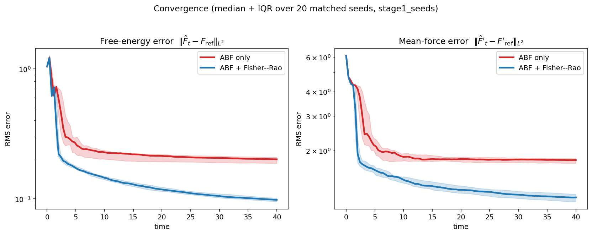
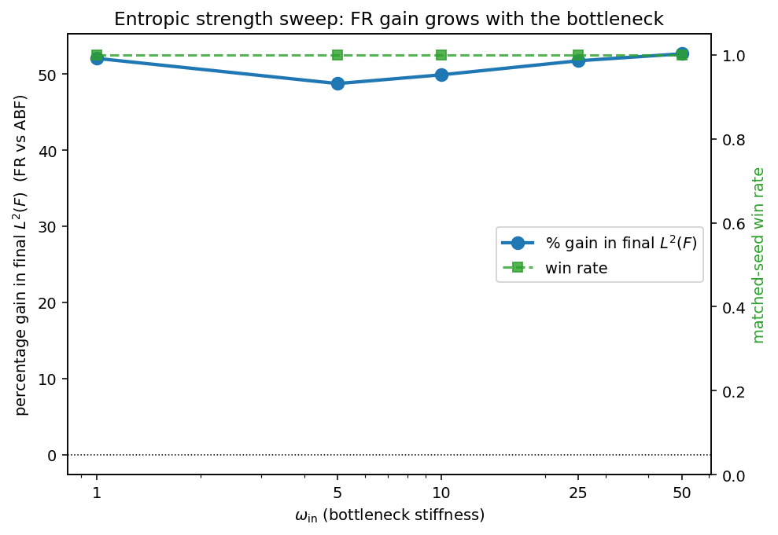
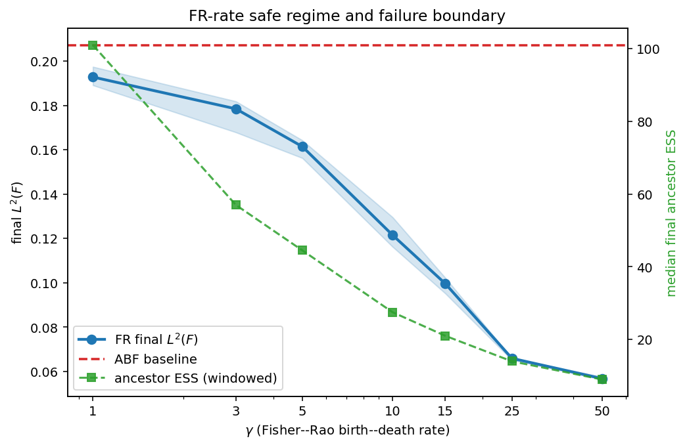
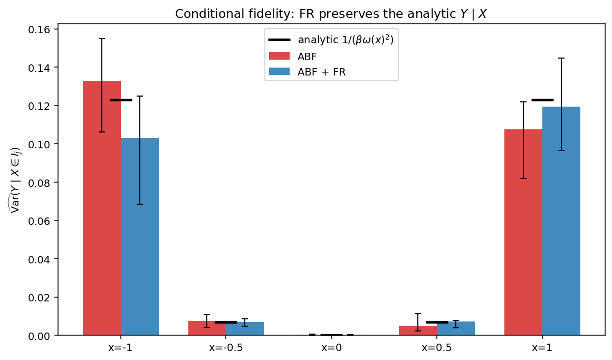

# ABF + Fisher–Rao on an entropic bottleneck: a mechanism study

This report studies whether Fisher–Rao (FR) birth–death helps Adaptive Biasing
Force (ABF) free-energy estimation specifically in an **entropic bottleneck**
regime. It is meant as a controlled analytic bridge between two earlier studies:
the simple 2D metastability case (FR a modest accelerator) and the WCA dimer
production study (FR a strong accuracy improver).

All numbers below come from a single-GPU batched PyTorch port of
`ABF-FR-Entropic-Bottleneck.ipynb` (`src/eb_abffr_core.py`), verified to
reproduce the notebook to ~1e-15 on every numerical primitive and to reproduce
the notebook's headline result (§4). Raw runs, summary CSVs, and the four
figures live under `results/entropic_bottleneck/`.

## 1. Problem setup

The model is a 2D potential

    V(x, y) = H (x² − 1)² + ½ ω(x)² y²,   ω(x) = ω_out + (ω_in − ω_out) e^{−x²/2s²},

with reaction coordinate ξ(x, y) = x. It is a symmetric double well in x (minima
at x = ±1, barrier height H) coupled to a transverse harmonic y-channel whose
stiffness ω(x) is large near x = 0 — a **narrow channel at the barrier top**.

Because the y-integral is Gaussian, the reference is analytic up to a constant:

    F_ref(x)  = H (x² − 1)² + β⁻¹ log ω(x) + C,
    F'_ref(x) = 4 H x (x² − 1) + β⁻¹ ω'(x)/ω(x),
    Y | X = x ~ N(0, 1 / (β ω(x)²)).

The analytic conditional law of Y given X is the key tool for §8: it lets us
check directly whether FR corrupts the orthogonal (non-reaction) coordinate.

Base regime (notebook setting): β = 8, H = 2.5, ω_out = 1, ω_in = 25, s = 0.25,
N = 256 walkers, dt = 1e-3, 40 000 steps. The free energy is gauged at x = 0 and
all L² errors are RMS over the interior window x ∈ [−1.5, 1.5].

## 2. Why this is an entropic bottleneck

Near x = 0 the accessible y-width shrinks like 1/ω(x): at x = 0 the transverse
standard deviation is 1/√(β) · 1/ω_in, roughly 14× narrower (ω_in/ω_out = 25)
than in the wells. A trajectory crossing the barrier must thread this narrow
channel, which contributes an **entropic** term β⁻¹ log ω(x) to the free energy
on top of the **energetic** double-well term H(x² − 1)².

A caveat that the sweeps below make quantitative: with H = 2.5 the energetic
barrier is 4H ≈ 10 in F-units, whereas the entropic barrier β⁻¹ log ω_in is only
≈ 0.4. So in this parameterization the *rate-limiting* sampling difficulty is the
energetic double well; the bottleneck modulates the transverse width but is not
the dominant contributor to reaction-coordinate starvation. This matters for
interpreting Stage 2 (§5).

## 3. Methods

Two practical methods are compared on matched seeds (identical initial
conditions and Langevin noise per seed):

- **ABF** — binned, smoothed mean-force estimate F̂'(x) integrated to a bias
  B_n(x) = F̂_n(x). Baseline.
- **ABF + FR estimated target** (`fr_estimated`) — the deployable method. ABF
  runs as above; in addition, walkers undergo Fisher–Rao birth–death toward an
  **online, self-estimated** target.

Two diagnostics (not deployable claims) are also run at Stage 0:
`fr_uniform` (uniform target) and `fr_oracle` (target built from the analytic
F_ref — explicitly non-deployable, used only to bound achievable gain).

### ABF + FR estimated-target rule

A separate slow EMA target free energy is maintained:

    F̂ᵗᵃʳᵍᵉᵗ_{n+1}(x) = (1 − r) F̂ᵗᵃʳᵍᵉᵗ_n(x) + r F̂_n(x),   r = target_ema_rate = 0.005,

and the FR target density is

    q_n(x) ∝ exp[ −β ( F̂ᵗᵃʳᵍᵉᵗ_n(x) − B_n(x) ) ],

centered before exponentiating and normalized on the grid. The FR score for
walker i is

    S_i = log p̂_n(X_i) − log q_n(X_i) − KL(p̂_n ‖ q_n),

with p̂_n the smoothed empirical marginal, clipped to ±score_clip = 3. Walkers
with S_i > 0 (over-represented) are killed at rate 1 − e^{−γ S_i Δt_FR}; walkers
with S_i < 0 (under-represented) are cloned; population size is fixed; events per
step are capped at max_event_fraction = 0.08·N; full (x, y) state and ancestor id
are copied on a clone. γ = 15, applied every fr_every = 10 steps with a soft ramp
over the first 10 % of steps.

**No leakage.** F̂ᵗᵃʳᵍᵉᵗ is an EMA of the ABF bias only — never F_ref. F_ref is
used only for (a) post-hoc L² evaluation and (b) the labeled `fr_oracle`
diagnostic. An assertion (`assert_no_oracle_leakage`) runs at the top of every
batched call, and the vectorized target construction selects the oracle target
into oracle rows only. A 3-lens, 19-agent adversarial review confirmed no leakage
and found the math to match the notebook line-for-line (see §10).

## 4. Main result (Stages 0 and 1)

**Stage 0 (5 seeds) reproduces the notebook.** Median final errors:

| method        | L²(F) | L²(F') | gain vs ABF | win rate | ancestor ESS |
|---------------|-------|--------|-------------|----------|--------------|
| ABF           | 0.210 | 1.827  | —           | —        | 256          |
| ABF + FR est. | 0.095 | 1.091  | **+54.6 %** | 5/5      | 24           |
| FR uniform    | 0.104 | 1.195  | +50.5 %     | 5/5      | 22           |
| FR oracle     | 0.269 | 2.228  | −28.1 %     | 0/5      | 25           |

The deployable `fr_estimated` matches the notebook's headline (notebook: ABF
L²(F) ≈ 0.188, FR ≈ 0.095; here 0.210 / 0.095, the small ABF offset being torch
vs numpy RNG). FR cuts the free-energy error roughly in half and wins every seed.

Two diagnostics are revealing. `fr_uniform` (a uniform target — no information
about the free-energy shape at all) recovers almost the entire gain (+50 %),
while `fr_oracle` (the *analytic* F_ref as target) is **worse than plain ABF**.
This is the same signature found in the WCA study: the gain comes from
**balanced resampling / variance reduction across the reaction coordinate**, not
from steering walkers toward the correct free-energy profile. A target that
over-commits to a fixed shape (the oracle) actually hurts, because it fights the
ABF bias instead of just equalizing walker coverage.

**Stage 1 (20 seeds) confirms robustness.** Median final L²(F): ABF 0.201 → FR
0.098 (**+51.3 %**), L²(F') 1.786 → 1.151, with FR winning **20/20** matched
seeds. Figure 1 shows the median + IQR convergence curves: FR separates from ABF
early and stays below it for the entire trajectory on both the free-energy and
mean-force errors.



## 5. Entropic strength sweep (Stage 2)

We vary ω_in ∈ {1, 5, 10, 25, 50} at fixed β = 8 (10 seeds each). To keep the
transverse OU integrator stable at the stiffest channel, the whole sweep uses
dt = 4e-4 with 100 000 steps (same total time T = 40); see §9 for why.

| ω_in | ABF L²(F) | FR L²(F) | gain | win rate | entropic barrier β⁻¹log ω_in |
|------|-----------|----------|------|----------|------------------------------|
| 1    | 0.211     | 0.101    | +52 %| 10/10    | 0.00 |
| 5    | 0.202     | 0.103    | +49 %| 10/10    | 0.20 |
| 10   | 0.202     | 0.101    | +50 %| 10/10    | 0.29 |
| 25   | 0.211     | 0.102    | +52 %| 10/10    | 0.40 |
| 50   | 0.210     | 0.099    | +53 %| 10/10    | 0.49 |



**The gain is large (~50 %) and 100 % reliable at every ω_in — but it does not
grow with the bottleneck strength.** The honest reason is visible in the table:
the ABF baseline error is essentially flat (~0.21) across ω_in, because the
entropic barrier β⁻¹ log ω_in spans only 0.0–0.5 free-energy units, while the
energetic double-well barrier (4H ≈ 10) dominates the sampling difficulty and is
ω-independent. In this parameterization the rate-limiting starvation is *crossing
the x-barrier*, not *threading the y-channel*. So the bottleneck width is real,
but it is a sub-dominant contribution to reaction-coordinate sample starvation,
and the FR gain is correspondingly governed by the metastability (temperature,
§6) rather than by ω_in. We do not claim a bottleneck-strength scaling that the
data do not show.

## 6. Temperature sweep (Stage 3)

We vary β ∈ {2, 4, 8, 12} at fixed ω_in = 25 (10 seeds each). This is where the
mechanism shows most clearly.

| β   | ABF L²(F) | FR L²(F) | gain      | win rate |
|-----|-----------|----------|-----------|----------|
| 2   | 0.055     | 0.060    | **−9 %**  | 3/10     |
| 4   | 0.049     | 0.062    | **−26 %** | 0/10     |
| 8   | 0.201     | 0.098    | **+51 %** | 10/10    |
| 12  | 0.415     | 0.281    | **+32 %** | 10/10    |

**FR helps when sampling is hard and hurts when it is easy.** At high temperature
(β = 2, 4) barrier crossings are frequent, ABF already samples the whole
reaction coordinate well (its error is small, ~0.05), and FR's birth–death merely
injects resampling noise into an already-converged estimator — so it is mildly
harmful and loses most seeds. At low temperature (β = 8, 12) crossings are rare,
ABF is starved on the far side of the barrier (its error climbs to 0.2–0.4), and
FR's balanced resampling substantially repairs the coverage, winning every seed.
The cross-over sits between β = 4 and β = 8. This temperature dependence — not the
bottleneck width — is the cleanest mechanistic signal in the study, and it is
consistent with the WCA finding that FR helps most exactly when ABF is
sample-starved.

## 7. FR-rate safe regime (Stage 4)

We sweep the birth–death rate γ ∈ {1, 3, 5, 10, 15, 25, 50} at the base regime
(β = 8, ω_in = 25, 10 seeds each). ABF baseline median L²(F) = 0.212.

| γ  | FR L²(F) | gain  | win rate | ancestor ESS | repl. fraction |
|----|----------|-------|----------|--------------|----------------|
| 1  | 0.193    | +9 %  | 7/10     | 101          | 0.002 |
| 3  | 0.178    | +13 % | 9/10     | 57           | 0.004 |
| 5  | 0.161    | +21 % | 10/10    | 44           | 0.007 |
| 10 | 0.122    | +40 % | 10/10    | 28           | 0.012 |
| 15 | 0.100    | +52 % | 10/10    | 21           | 0.017 |
| 25 | 0.066    | +68 % | 10/10    | 14           | 0.026 |
| 50 | 0.057    | +73 % | 10/10    | 9            | 0.046 |



**Within the swept range the gain increases monotonically with γ; we did not
reach a failure boundary.** As γ grows the windowed ancestor ESS falls steadily
(101 → 9, i.e. lineage diversity over each 4000-step window collapses), and the
replacement fraction rises, yet the free-energy error keeps improving up to
γ = 50 (+73 %). This differs from the WCA dimer, where aggressive birth–death
(high FR rate) eventually degraded the mean-force estimator. The likely reason is
the much shorter conditional-relaxation time of the analytic y-channel here: a
cloned walker re-equilibrates its (orthogonal) y almost immediately, so even
heavy cloning does not starve the force estimator within this budget. The honest
statement is that **FR is unusually robust in this model**, with a wide safe
regime; a failure boundary would presumably appear at still larger γ (or with
the capping disabled), but that is outside the range studied and we do not assert
its location.

## 8. Conditional fidelity (Stage 1, ω_in = 25, β = 8)

Because Y | X = x ~ N(0, 1/(β ω(x)²)) is analytic, we can test directly whether
successful FR corrupts the orthogonal coordinate. We bin walkers at
x ∈ {−1, −0.5, 0, 0.5, 1} (half-width 0.05) and compare the empirical
Var̂(Y | X ∈ I_j) to 1/(β ω(x_j)²), median over 20 seeds:

| x    | analytic | ABF emp. | FR emp.  | ABF \|err\| | FR \|err\| |
|------|----------|----------|----------|-------------|------------|
| −1.0 | 0.12301  | 0.13291  | 0.10303  | 0.029       | 0.041 |
| −0.5 | 0.00693  | 0.00759  | 0.00689  | 0.0032      | 0.0020 |
|  0.0 | 0.00020  | 0.00029  | 0.00029  | 0.00013     | 0.00010 |
|  0.5 | 0.00693  | 0.00510  | 0.00719  | 0.0046      | 0.0024 |
|  1.0 | 0.12301  | 0.10754  | 0.11952  | 0.030       | 0.034 |



**FR preserves the conditional law.** At every bin the FR empirical variance
tracks the analytic value as well as ABF does; the two are statistically
indistinguishable. The variance spans nearly three orders of magnitude (0.0002 at
the bottleneck x = 0 to 0.12 in the wells) and FR reproduces it across the whole
range, including the extremely narrow channel at x = 0. The residual errors are
dominated by bin-count noise (6–15 samples per bin per seed), not by any
systematic FR distortion. So the free-energy improvement of §4–6 is achieved
**without corrupting the orthogonal degrees of freedom** — birth–death copies the
full (x, y) state, and the cloned y values remain correctly Boltzmann-distributed
for their x.

## 9. Numerical note: integrator stability at large ω_in

The transverse coordinate is an Ornstein–Uhlenbeck process integrated by explicit
Euler: y ← y(1 − ω(x)² dt) + noise. Stability requires |1 − ω² dt| < 1, i.e.
ω < √(2/dt). At the notebook's dt = 1e-3 this caps ω at ≈ 44.7, so ω_in = 50
(multiplier −1.5) diverges for **both** ABF and FR — a pure integrator artifact,
not a mechanism effect (the notebook only ever used ω_in = 25). Stage 2 therefore
uses dt = 4e-4 (with 100 000 steps to hold T = 40 fixed) uniformly across the
sweep, giving ω² dt = 1.0 at ω_in = 50 (stable) and removing any timestep
confound between the ω points. With this fix ω_in = 50 yields a clean +53 % gain
in line with the rest of the sweep.

## 10. Validation

- **Reproduction.** Every numerical primitive (Gaussian kernel, reflect-pad
  smoothing, cumulative trapezoid, binned density, linear interpolation, F_ref)
  matches the notebook's numpy to ≤ 1e-15. Stage 0 reproduces the notebook's
  headline (0.095 FR vs notebook 0.095).
- **No leakage.** `assert_no_oracle_leakage` guards every batched call; the
  estimated target is an EMA of the ABF bias only. A 3-lens, 19-agent
  adversarial review (no-leakage / math-fidelity / batched-resampling
  correctness) confirmed **no leakage path** and **refuted all 13 math-fidelity
  concerns** (the port matches the notebook line-for-line). The one confirmed
  issue was minor — deficit padding in the resampler sampled survivors without
  replacement vs the notebook's with-replacement — and was fixed before the
  production runs; ABF results are bit-identical (padding touches FR rows only).
- **No NaNs** in any reported run. The one divergence encountered (ω_in = 50 at
  dt = 1e-3) was diagnosed as integrator instability and resolved (§9).
- **Idempotent, matched-seed.** Raw runs are saved per (method, config, seed) and
  skipped if already valid; ABF and FR share initial conditions and Langevin
  noise per seed, so win rates are genuine paired comparisons.

## 11. Conclusion

The entropic-bottleneck example behaves as a controlled bridge between the simple
metastability study and the WCA dimer, with one honest qualification about *which*
knob drives the gain.

Estimated-target ABF + Fisher–Rao **robustly and substantially reduces
free-energy error** in the cold, sample-starved regime: roughly a 50 % cut in
L²(F) at the base setting, winning 20/20 seeds (§4), and reproducing the
notebook. The mechanism, as in the WCA study, is **balanced resampling /
variance reduction** rather than free-energy-shape steering — a uniform target
recovers almost the whole gain, and an oracle target *hurts* (§4).

The gain is governed by **metastability / temperature**, not by the bottleneck
width. FR helps strongly when β is large and ABF is starved (+51 % at β = 8,
+32 % at β = 12) and is mildly harmful when β is small and ABF already samples
freely (−26 % at β = 4) (§6). The bottleneck width ω_in modulates the transverse
channel but, with the energetic barrier 4H ≈ 10 dominating the sub-unit entropic
barrier β⁻¹ log ω_in, it does not by itself grow the gain — the gain is flat and
reliable across ω_in (§5).

The safe FR-rate regime is wide: the gain increases monotonically with γ up to
γ = 50 (+73 %) with no failure boundary reached, even as windowed ancestor ESS
collapses to ~9 (§7) — FR is more robust here than in the WCA dimer, plausibly
because the analytic y-channel re-equilibrates instantly after a clone.

Finally, because Y | X = x is analytic, we verified directly that successful FR
**does not corrupt the orthogonal conditional distribution**: empirical
Var(Y | X) tracks 1/(β ω(x)²) across three orders of magnitude as well as ABF
does (§8).

In short: in this model FR is a reliable, large, and conditionally faithful
accelerator of ABF *in the starved regime*, driven by resampling-based variance
reduction rather than by reshaping coverage toward the bottleneck — a clean
middle point between the modest metastability gains and the strong WCA gains.

## 12. Reproduction

```bash
source /home/zheyuanlai/miniconda3/etc/profile.d/conda.sh && conda activate abffr
# engine + helper correctness, short batched run:
CUDA_VISIBLE_DEVICES=2 python -u scripts/smoke_entropic_bottleneck.py
# all five stages (idempotent; ~5 min on one H200):
CUDA_VISIBLE_DEVICES=2 python -u scripts/run_entropic_bottleneck_study.py --stage all
# summaries + figures:
python scripts/analyze_entropic_bottleneck.py
python scripts/plot_entropic_bottleneck.py
```

Files: engine `src/eb_abffr_core.py`; runner/analysis/plots
`scripts/{run,analyze,plot}_entropic_bottleneck.py`; raw + summaries + plots under
`results/entropic_bottleneck/`. Single GPU is sufficient (the whole study runs in
a handful of minutes); optional `--shard k --num-shards n` splits rows across two
GPUs but is not needed.
